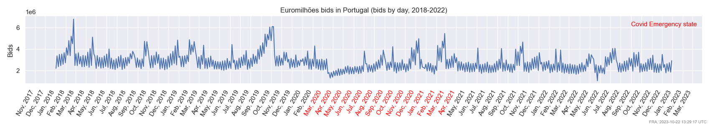
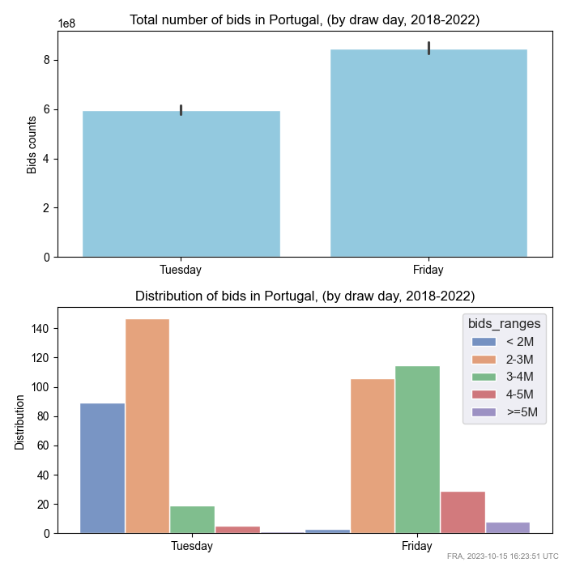
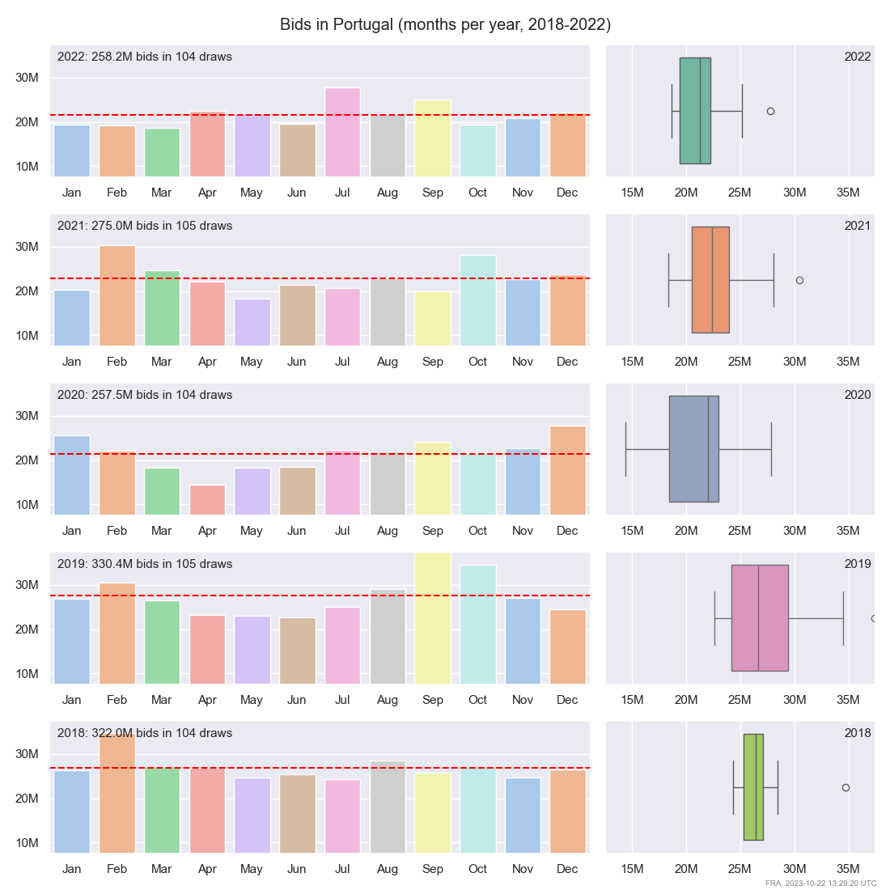
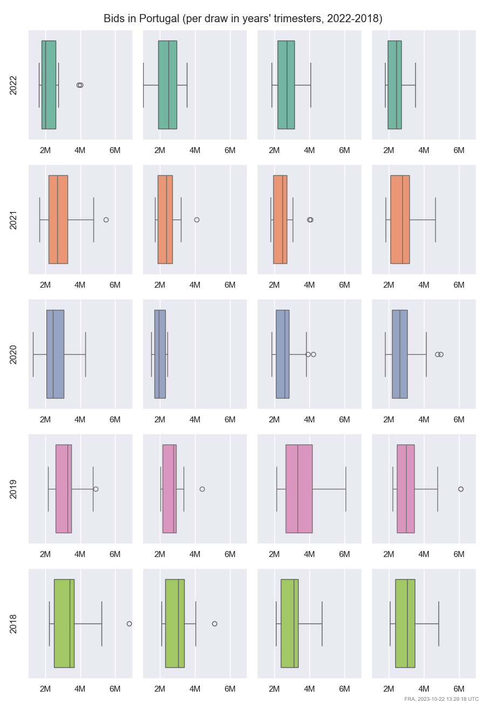
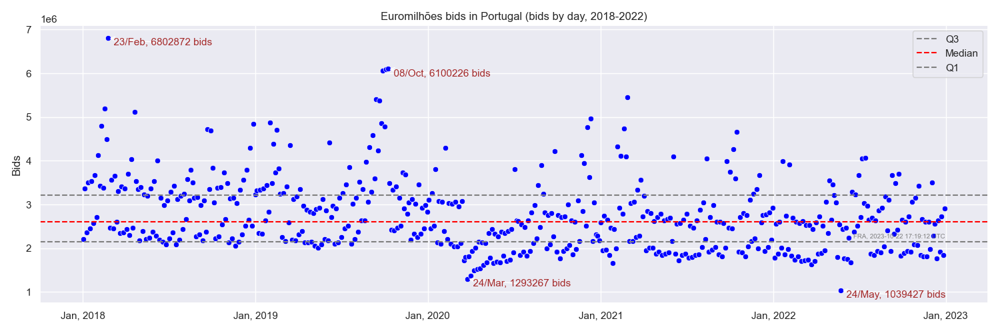
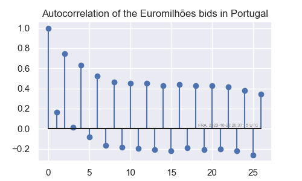
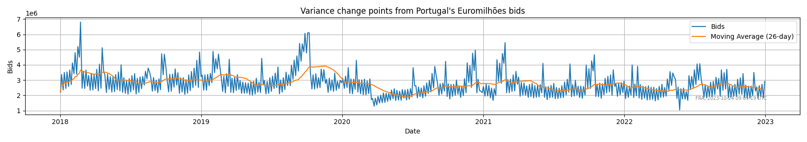

# Time Series and Forecast project - Part 1
This paper responds to the course project for the Time Series and Forecast course,
ministered by the Professor Maria Eduarda Silva, for UP - Universidade do Porto.


## Assignment

Choose a time series of your interest and write a concise report
(pdf, max 6 pages, including appendices) describing
the exploratory analysis of the time series.


## The time series
### Introduction
The time series here employed has data for Euromilhões draws in Portugal. The data set,
a [CSV file](../data/euromilhoes.pt.csv), holds data from 2004 to October 2023, but the present study
will consider draws between 2018 and 2022.

Within these years, draws occurred twice a week, having 522 draw events in the serie
as reported on our next chapter about the data overview.

Data was checked for inconsistencies and duplications. Once the data scrapping showed that some bids
were added later and out of order, the scrapper program was tuned a few times in order to cover
all data, preventing gaps and failures.

### Data overview
The following report and plot were generated from the data frame loaded from the CSV.
As mentioned earlier, our study's data events happened between years 2018 and 2022.
```text
| observation        |                value |
|--------------------+----------------------|
| min draw date      |           2018-01-02 |
| max draw date      |           2022-12-30 |
| count draw dates   |                  522 |
| missing values     |                    0 |
| sum of all bids    |           1443202757 |
| min bids in a draw | 1039427 (2022-05-24) |
| max bids in a draw | 6802872 (2018-02-23) |
```

The plot shows the complete timeline,
with all bids per draw in the time period (the x labels are grouped, not the bids).
The plot suggests, among other info, that people bet from 2 to 4 million bids per draw on the time.\



### Initial statistical analysis
The following report confirms that the majority of draws received between 2 and 4 million bids each.
The quartile numbers further refine this range to approximately 2.1 to 3.2 million bids:
```text
| statistic          |     value |
|--------------------+-----------|
| count draws/year   |   104-105 |
| average draws/week |       1.9 |
| median of all bids | 2608674.5 |
| Q1                 | 2147098.8 |
| Q3                 | 3207317.5 |
```
<br />

This can also be observed in the next plot, which illustrates bids distribution by draw day:



The following plots show the QQ behaviors comparing months and trimesters of the years in the series.
An initial observation can suggest that there are fewer bids or more stable bids numbers
in second trimesters.





### Unusual values and search for outliers

Some draw days show bids way out of QQ range and can be spotted on the next plot.
The most extreme values are highlighted by annotations with the number of bids and draw date:



### Data autocorrelation

An autocorrelation function plot, or ACR plot, was created to identify if there is seasonal
and trend behaviour in this data set. No seasonality was captured from the absolute values in the serie.



### Moving average

A moving average plotted in a window of 5% of the total do not show a significant trend, but
a decrease on the volume of bids can be seen. A trend can be considered, after all:




## Conclusion

In this dataset, a significant seasonality trend is not prominently observed.
However, the data hints at a noteworthy decline in bids for Portugal's Euromilhões.
Remarkably, the sporadic spikes observed in February 2018, October 2019,
and February 2021 have not recurred.

The onset of this diminishing trend aligns with the emergence of the Covid-19 pandemic,
a period marked by widespread social isolation and restricted mobility.


<br />

#### References and links

This project is published in [this GitHub link](https://github.com/nandoabreu/euromilhoes),
together with all code to scrap data, generate statistical data and create plots. \
All data was fetched from
[Portugal's official Euromilhões provider](https://www.jogossantacasa.pt/web/SCCartazResult/euroMilhoes).
