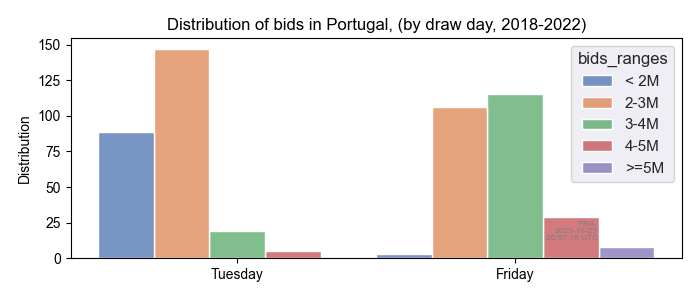

# Time Series and Forecast project - Part 1
This paper responds to the course project for the Time Series and Forecast course,
ministered by the Professor Maria Eduarda Silva, for UP - Universidade do Porto.

## Assignment

Choose a time series of your interest and write a concise report
(pdf, max 6 pages, including appendices) describing
the exploratory analysis of the time series.

### The time series
#### Introduction
The time series here employed has data for Euromilhões draws in Portugal. The data set,
a [CSV file](../data/euromilhoes.pt.csv), holds data from 2004 to October 2023, but the present study
will consider draws between 2018 and 2022.

Within these years, draws occurred twice a week, having 522 draw events in the serie
as reported on our next chapter about the data overview.

#### Data overview
The following report and plot were generated from the data frame loaded from the CSV.
As mentioned earlier, our study's data events happened between years 2018 and 2022.
```text
| observation        |                value |
|--------------------+----------------------|
| min draw date      |           2018-01-02 |
| max draw date      |           2022-12-30 |
| count draw dates   |                  522 |
| missing values     |                    0 |
| sum of all bids    |           1443202757 |
| min bids in a draw | 1039427 (2022-05-24) |
| max bids in a draw | 6802872 (2018-02-23) |
```

The plot shows the complete timeline,
with all bids per draw in the time period (the x labels are grouped, not the bids).
The plot suggests, among other info, that people bet from 2 to 4 million bids per draw on the time.\


#### Initial statistical analysis
The following report confirms that the majority of draws received between 2 and 4 million bids each.
The quartile numbers further refine this range to approximately 2.1 to 3.2 million bids:
```text
| statistic          |     value |
|--------------------+-----------|
| count draws/year   |   104-105 |
| average draws/week |       1.9 |
| median of all bids | 2608674.5 |
| Q1                 | 2147098.8 |
| Q3                 | 3207317.5 |
```

This can also be observed in the second plot below, which illustrates
the distribution of bids in Portugal by draw:\


<!-- # Check: [modelling_with-AR_models](https://moodle2324.up.pt/mod/folder/view.php?id=81448) -->
<!-- ChatGPT: plots: line, scatter, histograms, autocorrelation, boxplots, to reveal patterns, seasonality, trends -->
